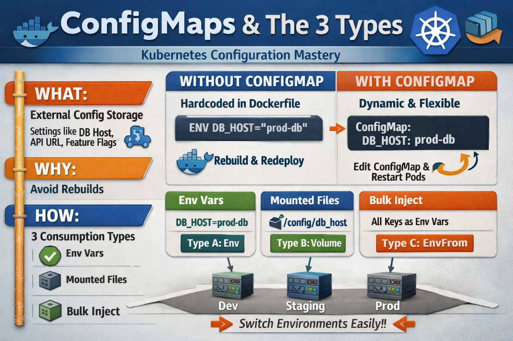

# Kubernetes ConfigMaps - Complete Guide



## 🎯 Project Overview

This repository provides a comprehensive, hands-on guide to understanding and implementing Kubernetes ConfigMaps on AWS EKS. Learn how to separate configuration from application code following cloud-native best practices.

## 📚 Table of Contents

- [What are ConfigMaps?](#what-are-configmaps)
- [Architecture](#architecture)
- [The 3 Types of ConfigMap Consumption](#the-3-types)
- [Prerequisites](#prerequisites)
- [Hands-On Labs](#hands-on-labs)
- [Real-World Scenarios](#real-world-scenarios)
- [Best Practices](#best-practices)

## 🔍 What are ConfigMaps?

A ConfigMap stores **non-secret configuration data** outside your container image, enabling you to:

- ✅ Use the same Docker image across Dev/Staging/Prod
- ✅ Change configuration without rebuilding images
- ✅ Separate configuration from application code
- ✅ Follow 12-Factor App principles

### Why ConfigMaps Exist

**Without ConfigMap:**
```dockerfile
ENV DB_HOST=prod-db
ENV API_URL=https://api.company.com
```
❌ Config change requires: Edit Dockerfile → Rebuild → Push → Redeploy

**With ConfigMap:**
```bash
kubectl edit configmap my-config
kubectl rollout restart deployment app
```
✅ No rebuild, no new image, instant update

## 🏗️ Architecture

See [ARCHITECTURE.md](./ARCHITECTURE.md) for detailed architecture diagrams and explanations.

### How ConfigMaps Work Internally

```
Developer (kubectl)
       ↓
   API Server
       ↓
   etcd (stores ConfigMap)
       ↓
   Kubelet (when Pod starts)
       ↓
   Inject into Container
```

**Storage Location:** `/registry/configmaps/<namespace>/<configmap-name>` in etcd

## 🎨 The 3 Types of ConfigMap Consumption

## Type A: env (Single Key → Single Env Var)
Map specific keys to environment variables.

```yaml
env:
  - name: DB_HOST
    valueFrom:
      configMapKeyRef:
        name: my-config
        key: DB_HOST
```

**Use when:** You need 1-2 specific variables

### Type B: Volume Mount (Keys → Files)
Each key becomes a file in a directory.

```yaml
volumeMounts:
  - name: config-volume
    mountPath: /etc/config
volumes:
  - name: config-volume
    configMap:
      name: my-config
```

**Use when:** You need config files (nginx.conf, app.properties)

### Type C: envFrom (Bulk Inject All Keys)
All keys become environment variables automatically.

```yaml
envFrom:
  - configMapRef:
      name: my-config
```

**Use when:** You have many key-value configs

### 🧠 Memory Trick: C-E-V
- **C**ommand
- **E**nvironment
- **V**olume

## 📋 Prerequisites

- AWS Account with EKS access
- kubectl installed
- AWS CLI configured
- Docker installed
- Basic Kubernetes knowledge

## 🚀 Hands-On Labs

1. **[Lab 1: Create EKS Cluster](./labs/lab1-eks-setup.md)** - Set up AWS EKS cluster
2. **[Lab 2: Type A - Environment Variables](./labs/lab2-type-a-env.md)** - Single key injection
3. **[Lab 3: Type B - Volume Mounts](./labs/lab3-type-b-volume.md)** - Config files as volumes
4. **[Lab 4: Type C - Bulk Injection](./labs/lab4-type-c-envfrom.md)** - Auto-inject all keys
5. **[Lab 5: Multi-Environment Setup](./labs/lab5-multi-env.md)** - Real-world deployment
6. **[Lab 6: Immutable ConfigMaps](./labs/lab6-immutable-configmap.md)** - Production safety

See [labs/](./labs/) directory for all labs.

## 🌍 Real-World Scenarios

### Scenario 1: Multi-Environment Deployment

Same Docker image, different configs:

| Environment | DB_HOST | APP_MODE | LOG_LEVEL |
|-------------|---------|----------|-----------|
| Dev | dev-db | development | debug |
| Staging | staging-db | staging | info |
| Production | prod-db | production | info |

### Scenario 2: Feature Flags

Toggle features without redeployment:
```bash
kubectl patch configmap app-config -p '{"data":{"FEATURE_NEW_UI":"false"}}'
kubectl rollout restart deployment my-app
```

### Scenario 3: Emergency DB Migration

Production DB changes from `prod-db` to `prod-db-v2`:
```bash
kubectl edit configmap app-config
# Change DB_HOST value
kubectl rollout restart deployment my-app
```

⏱️ **Time to update:** 30 seconds (vs hours for image rebuild)

## 📊 ConfigMap vs Hardcoded Comparison

| Scenario | Without ConfigMap | With ConfigMap |
|----------|-------------------|----------------|
| DB host change | Rebuild image | Edit ConfigMap |
| API URL change | Rebuild image | Edit ConfigMap |
| Feature flag toggle | Rebuild image | Edit ConfigMap |
| Dev/Prod difference | Multiple images | Same image |

## 🎓 Best Practices

1. **Never store secrets in ConfigMaps** - Use Kubernetes Secrets instead
2. **Use immutable ConfigMaps in production** - Prevents accidental changes
3. **Version your ConfigMaps** - Include version in name (app-config-v1)
4. **Document your keys** - Maintain a schema of expected keys
5. **Use volume mounts for large configs** - Better for files like nginx.conf

## 🔒 ConfigMap vs Secret

| Feature | ConfigMap | Secret |
|---------|-----------|--------|
| Storage | Plain text | Base64 encoded |
| Use for | DB host, API URL | Passwords, tokens |
| Encryption | No | Optional (at rest) |
| Visibility | kubectl get cm | kubectl get secret |

## 📁 Project Structure

```
.
├── README.md
├── assets/
│   ├── configmaps-banner.png
│   ├── architecture.png
│   └── mindmap.png
├── labs/
│   ├── lab1-eks-setup.md
│   ├── lab2-type-a-env.md
│   ├── lab3-type-b-volume.md
│   ├── lab4-type-c-envfrom.md
│   └── lab5-multi-env.md
├── manifests/
│   ├── configmap-literal.yaml
│   ├── configmap-file.yaml
│   ├── deployment-env.yaml
│   ├── deployment-volume.yaml
│   └── deployment-envfrom.yaml
└── examples/
    ├── app.properties
    ├── nginx.conf
    └── sample-app/
```

## 🧪 Quick Start

```bash
# Clone the repository
git clone https://github.com/SrinathMLOps/ConfigMaps.git
cd ConfigMaps

# Create a ConfigMap
kubectl create configmap my-config \
  --from-literal=DB_HOST=prod-db \
  --from-literal=API_URL=https://api.company.com

# View ConfigMap
kubectl get cm my-config -o yaml

# Use in deployment
kubectl apply -f manifests/deployment-envfrom.yaml
```

📖 **New to ConfigMaps?** Start with [QUICK-START.md](./QUICK-START.md)

🔖 **Need quick reference?** Check [CHEATSHEET.md](./CHEATSHEET.md)

🧠 **Want to understand deeply?** Read [MINDMAP.md](./MINDMAP.md)

## 📖 Additional Resources

- [Kubernetes Official Docs - ConfigMaps](https://kubernetes.io/docs/concepts/configuration/configmap/)
- [12-Factor App Methodology](https://12factor.net/)
- [AWS EKS Best Practices](https://aws.github.io/aws-eks-best-practices/)

## 🤝 Contributing

Contributions are welcome! Please open an issue or submit a pull request.

## 📝 License

MIT License - feel free to use this for learning and production.

## 👨‍💻 Author

**Srinath**
- GitHub: [@SrinathMLOps](https://github.com/SrinathMLOps)

---

⭐ If you find this helpful, please star the repository!
